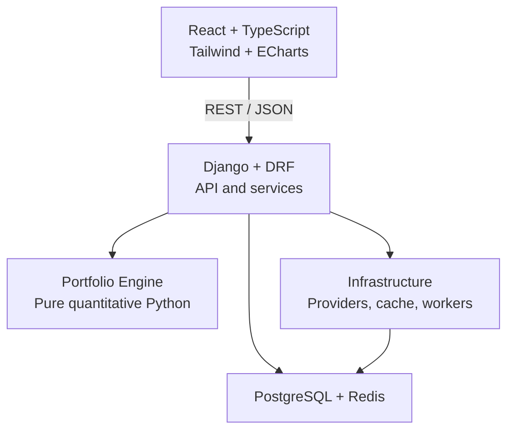

# Portfolio Intelligence

> A transparent investment analytics and strategy-research platform for understanding portfolio performance, risk, allocation, rebalancing, and historical strategy behavior.


Portfolio Intelligence is an investment research and decision-support application designed to make rigorous portfolio analytics understandable to everyday investors. It combines a Django API, a framework-independent quantitative engine, a React dashboard, provider-neutral market data, and reproducible historical simulations.

The product is intentionally built around a strict hierarchy:

```text
data → deterministic analytics → structured results → explanation and visualization → decision support
```

Calculations belong to the quantitative engine. The frontend presents them. A future AI layer will explain validated results, but it will not invent portfolio metrics or silently make trading decisions.

> Portfolio Intelligence is a research, simulation, analysis, and educational tool. It is not a brokerage, trade-execution platform, fiduciary adviser, or autonomous investment manager. Historical and simulated results do not guarantee future performance.

## Table of Contents

- [Why Portfolio Intelligence](#why-portfolio-intelligence)
- [Product Capabilities](#product-capabilities)
- [Portfolio Lab](#portfolio-lab)
- [Release Roadmap](#release-roadmap)
- [Architecture](#architecture)
- [Technology Stack](#technology-stack)
- [Repository Structure](#repository-structure)
- [Getting Started](#getting-started)
- [Development URLs](#development-urls)
- [Quality Checks](#quality-checks)
- [Market-Data Workflows](#market-data-workflows)
- [API and OpenAPI](#api-and-openapi)
- [Analytical Integrity](#analytical-integrity)
- [Testing Strategy](#testing-strategy)
- [Security and Privacy](#security-and-privacy)
- [MVP Boundaries](#mvp-boundaries)
- [Documentation](#documentation)
- [Contributing](#contributing)
- [License](#license)
- [Third Party Notice](#third-party-notice)

## Why Portfolio Intelligence

Most consumer portfolio tools show balances and price changes but provide limited insight into the decisions and risks underneath them. More advanced platforms often assume institutional knowledge or obscure their calculations behind proprietary scores.

Portfolio Intelligence is designed to answer five practical questions:

1. How is my portfolio performing?
2. What risks am I taking?
3. Am I actually diversified?
4. How would alternative allocations or rebalancing rules have behaved historically?
5. How would a defined investment strategy have performed under explicit assumptions?

Every analytical result is intended to be traceable to its inputs, period, market-data source, calculation convention, assumptions, warnings, and engine version.

## Product Capabilities

Portfolio Intelligence is being delivered in bounded releases. The lists below describe the intended product surface; consult the [Release Roadmap](#release-roadmap) for delivery status.

### Portfolio management

- Create and manage portfolios.
- Record deposits, withdrawals, buys, sells, and optional cash dividends.
- Import transactions using a documented CSV format.
- Derive holdings and cash from the transaction ledger.
- Select a portfolio benchmark.
- Keep actual holdings separate from hypothetical Portfolio Lab experiments.

### Market-data exploration

- Submit multiple ticker symbols in one request.
- Normalize, validate, de-duplicate, and resolve symbols while preserving user order.
- Retrieve daily OHLCV and adjusted-close data.
- Use yfinance as the credential-free development provider.
- Add Alpaca and future providers behind the same server-side contract.
- Preserve per-symbol success, no-data, not-found, and failure outcomes.
- Display multi-symbol price comparisons and individual candlestick/volume charts with Apache ECharts.
- Expose provider, retrieval time, coverage, price convention, and warnings.

### Portfolio analytics

- Current market value and allocation.
- Gain/loss when cost-basis information is available.
- Time-weighted and cumulative returns.
- CAGR and annualized geometric return.
- Annualized volatility.
- Sharpe and Sortino ratios.
- Wealth and drawdown series.
- Maximum drawdown.
- Beta and correlation.
- Concentration measures.
- Rolling returns and benchmark comparisons.

### Allocation and rebalancing

- Compare current, equal-weight, minimum-variance, and maximum-Sharpe allocations.
- Generate an efficient frontier under explicit long-only constraints.
- Define target weights and inspect allocation drift.
- Simulate rebalance trades without presenting them as executable orders.
- Compare monthly, quarterly, annual, and threshold-based rebalancing.
- Preserve optimization inputs, constraints, results, warnings, and solver status.

### Dashboard experience

- Portfolio performance as the primary visual hierarchy.
- Portfolio breakdown, allocation, and explainable health indicators.
- Holdings, gainers, losers, contributors, detractors, and rebalance candidates.
- Visible data-freshness, warning, and partial-data states.
- Responsive desktop, tablet, and mobile layouts.
- WCAG 2.2 AA target for supported workflows.
- A future grounded intelligence panel connected to deterministic analytical results.

## Portfolio Lab

The Portfolio Lab is the dedicated research workspace for constructing hypothetical portfolios and evaluating how allocation and rebalancing choices would have behaved historically.

Users will be able to:

- Start with a blank hypothetical portfolio, a watchlist, a saved experiment, or a copy of an actual portfolio.
- Select securities and define cash, weight, and group constraints.
- Choose an allocation methodology.
- Choose buy-and-hold, calendar, threshold, or hybrid rebalancing.
- Configure the analysis period, benchmark, initial capital, costs, slippage, dividends, cash flows, and execution assumptions.
- Run deterministic backtests without exposing a strategy to future observations.
- Compare portfolio value, return, volatility, drawdown, risk-adjusted performance, turnover, and costs.
- Inspect allocation history, rebalance events, contributions, and trade history.
- Save, clone, reopen, compare, and export reproducible experiments.

The public MVP strategy catalog is deliberately focused:

- buy and hold;
- moving-average timing;
- momentum;
- scheduled allocation rebalancing;
- drift-threshold rebalancing.

Broader strategy and optimization research—including risk parity, Black–Litterman, hierarchical risk parity, VaR/CVaR, factor models, and large-scale parameter search—remains later-phase work until the foundational optimizer and backtest engine are independently validated.

## Release Roadmap

| Release | Focus | Status |
| --- | --- | --- |
| `v0.1.0` | Deterministic market data, ledger-derived holdings, portfolio analytics, API surface, and analytics UI | In development |
| `v0.2.0` | Equal weight, minimum variance, maximum Sharpe, efficient frontier, and rebalance simulation | Planned |
| `v0.3.0` | Historical backtesting, initial strategy catalog, costs, comparisons, and Portfolio Lab | Planned public MVP |
| `v0.4.0` | Grounded AI Portfolio Analyst over structured analytical results | Post-MVP |

Development follows the ordered phase gates in [`docs/dev-guide.md`](docs/dev-guide.md). A later-phase feature should not be added merely because it is easy to scaffold; its inputs, mathematics, failure behavior, tests, and acceptance criteria must be defined first.

## Architecture



### Architectural boundaries

The `portfolio_engine` package is a framework-independent analytical library. It may depend on NumPy, pandas, SciPy, and the Python standard library, but it must not depend on Django, DRF, the ORM, Redis, Celery, HTTP clients, authentication state, or frontend code.

The Django application layer owns:

- authentication and portfolio authorization;
- API validation and serialization;
- transaction persistence;
- application-service orchestration;
- provider selection and caching;
- asynchronous-run orchestration;
- stable API error mapping.

The React application owns presentation, input, navigation, comparison workflows, charting, and accessible explanations. It must not become an alternative calculation engine.

## Technology Stack

| Layer | Technology |
| --- | --- |
| Backend runtime | Python 3.12.12 |
| Web framework | Django 5.2 and Django REST Framework |
| API schema | drf-spectacular / OpenAPI |
| Quantitative engine | NumPy, pandas, SciPy |
| Database | PostgreSQL 17.11 |
| Cache/background work | Redis and Celery when required |
| Market data | CSV/sample, mock, yfinance, optional Alpaca adapter |
| Frontend | React, TypeScript strict mode, Vite |
| UI and visualization | Tailwind CSS, Apache ECharts |
| Remote state and routing | TanStack Query, React Router |
| Backend testing | pytest, pytest-django, Hypothesis |
| Frontend testing | Vitest and Playwright |
| Quality tools | Ruff and mypy |
| Local platform | Docker Compose |
| Continuous integration | GitHub Actions |

Committed lockfiles are authoritative for reproducible dependency installation:

- `backend/uv.lock`
- `frontend/package-lock.json`

## Repository Structure

```text
portfolio-intelligence/
├── README.md
├── LICENSE
├── docker-compose.yml
├── .env.example
├── Makefile
├── docs/
│   ├── dev-guide.md
│   ├── setup.md
│   ├── portfolio-dashboard-requirements.md
│   ├── portfolio-model-gap-register.md
│   ├── architecture.md
│   ├── analytics-methodology.md
│   ├── api-design.md
│   ├── data-model.md
│   └── amendments/
├── backend/
│   ├── apps/
│   │   ├── accounts/
│   │   ├── assets/
│   │   ├── market_data/
│   │   ├── portfolios/
│   │   ├── analytics/
│   │   ├── optimization/
│   │   └── backtesting/
│   ├── portfolio_engine/
│   │   ├── contracts/
│   │   ├── performance/
│   │   ├── portfolio/
│   │   ├── risk/
│   │   ├── optimization/
│   │   ├── rebalancing/
│   │   ├── backtesting/
│   │   └── strategies/
│   └── tests/
│       ├── unit/
│       ├── property/
│       ├── integration/
│       ├── validation/
│       └── architecture/
├── frontend/
│   ├── src/
│   │   ├── api/
│   │   ├── components/
│   │   ├── features/
│   │   ├── hooks/
│   │   ├── layouts/
│   │   ├── pages/
│   │   └── types/
│   └── tests/
├── sample_data/
└── scripts/
```

The structure above is the target architecture. A directory associated with a later phase may be absent or intentionally contain only scaffolding until that phase begins.

## Getting Started

Portfolio Intelligence uses a Docker-first development workflow.

### Prerequisites

- Git
- Docker Desktop or Docker Engine
- Docker Compose v2
- GNU Make for the repository convenience targets

Host installations of Python, `uv`, Node.js, and npm are optional when all development commands run through Docker. They are required when running backend or frontend tools directly on the host.

### 1. Configure the environment

After cloning the repository, create the local environment file.

PowerShell:

```powershell
Copy-Item .env.example .env
```

Bash:

```bash
cp .env.example .env
```

Or use the repository target:

```bash
make bootstrap-env
```

Review `.env`, replace placeholder secrets, and retain the development settings module:

```dotenv
DJANGO_SETTINGS_MODULE=config.settings.dev
```

Never commit `.env`.

### 2. Build and start the stack

```bash
make up-build
```

Equivalent Docker command:

```bash
docker compose up -d --build
```

Check the service state:

```bash
docker compose ps
```

Expected services:

- `db` — healthy;
- `backend` — running;
- `frontend` — healthy.

### 3. Apply migrations

```bash
docker compose run --rm backend \
  python manage.py migrate --noinput --settings=config.settings.dev
```

Verify the Django configuration and migration state:

```bash
docker compose run --rm backend \
  python manage.py check --settings=config.settings.dev

docker compose run --rm backend \
  python manage.py makemigrations --check --dry-run --settings=config.settings.dev
```

### 4. Open the application

Visit the frontend at [http://127.0.0.1:5173/](http://127.0.0.1:5173/).

Common stack commands:

```bash
make up
make down
make logs
```

For a complete clean-clone verification workflow, follow [`docs/setup.md`](docs/setup.md).

## Development URLs

| Service | URL |
| --- | --- |
| React frontend | [http://127.0.0.1:5173/](http://127.0.0.1:5173/) |
| API health | [http://127.0.0.1:8000/api/v1/health/](http://127.0.0.1:8000/api/v1/health/) |
| OpenAPI schema | [http://127.0.0.1:8000/api/v1/schema/](http://127.0.0.1:8000/api/v1/schema/) |
| Swagger UI | [http://127.0.0.1:8000/api/v1/docs/](http://127.0.0.1:8000/api/v1/docs/) |

Expected health response:

```json
{
  "status": "ok"
}
```

## Quality Checks

Run the backend quality gates from the repository root:

```bash
make format-check
make lint
make typecheck
make test
```

These commands validate Ruff formatting, Ruff linting, strict mypy typing, and pytest.

Run the frontend gates from `frontend/`:

```bash
npm ci
npm run typecheck
npm test
npm run build
```

Use the committed lockfiles. Normal validation should not update dependency versions or rewrite the locks.

## Market-Data Workflows

### Deterministic offline demonstration

Run the committed sample-data workflow without network access:

```bash
make market-data-offline-demo
```

The expected ordered outcomes are:

| Symbol | Status | Bars |
| --- | --- | ---: |
| `AAPL` | `SUCCEEDED` | 5 |
| `MSFT` | `SUCCEEDED` | 5 |
| `EMPTY` | `NO_DATA` | 0 |
| `UNKNOWN` | `NOT_FOUND` | 0 |

The total output row count is 10. This workflow verifies canonical normalization, CSV-provider provenance, inclusive-start/exclusive-end bounds, stable symbol ordering, de-duplication, and explicit partial outcomes.

### Explicit live yfinance smoke

Run the bounded live-provider check manually:

```bash
make market-data-live-smoke
```

The live smoke uses `AAPL` and `MSFT` over a fixed daily interval. It is intentionally excluded from normal pytest and pull-request CI because it depends on external provider availability.

Provider failures, throttling, and no-data responses must remain visible. Analytical requests must not silently switch providers because doing so would change data provenance and potentially change calculated values.

## API and OpenAPI

All public routes are versioned under:

```text
/api/v1
```

The intended resource groups include:

```text
/assets
/market-data/providers
/market-data/bars/query
/portfolios
/portfolios/{id}/transactions
/portfolios/{id}/holdings
/analytics
/optimization-runs
/rebalance-simulations
/backtest-runs
```

### Multi-symbol market-data query

```http
POST /api/v1/market-data/bars/query
Content-Type: application/json
```

```json
{
  "symbols": ["AAPL", "MSFT", "VTI"],
  "start": "2025-01-01",
  "end": "2026-01-01",
  "interval": "1d",
  "provider": "yfinance"
}
```

The start date is inclusive and the end date is exclusive. Responses retain the normalized request order and return a distinct status for each symbol so one unavailable ticker does not erase successful results.

### OpenAPI contract

The committed schema is located at `backend/openapi.yaml`. Regenerate and validate it with:

```bash
make openapi
git diff --exit-code -- backend/openapi.yaml
```

Do not edit the generated schema manually. Change the DRF or drf-spectacular source contract, regenerate it, and review the resulting diff.

## Analytical Integrity

Portfolio Intelligence treats analytical correctness as a product feature.

### Reproducible results

Derived results should retain or reference:

- analysis period and as-of date;
- market-data provider and retrieval cutoff;
- price field and adjustment convention;
- benchmark;
- annualization factor;
- risk-free or minimum-acceptable-return assumption;
- calculation and strategy version;
- optimization or backtest configuration;
- transaction-cost and slippage assumptions;
- warnings and insufficient-data conditions.

### No hidden assumptions

Undefined analytical values are represented as `null` with a warning—not `NaN`, infinity, zero, or a fabricated estimate. Missing observations remain missing unless an explicitly documented policy applies.

### Anti-look-ahead backtesting

Backtests follow an observe-now, execute-later rule:

```text
observe through close(t)
        ↓
generate signal(t)
        ↓
execute at adjusted_close(t+1)
```

Strategies receive a time-bounded context whose visible history ends at the decision date. A strategy must never receive an unrestricted future dataframe and rely on developer discipline not to inspect it.

### Optimization validation

Optimization results are not accepted simply because a numerical solver returned an array. The engine independently checks:

- solver success;
- finite objectives and weights;
- weight-sum tolerance;
- configured lower and upper bounds;
- all equality and inequality constraints;
- explicit infeasibility and failure behavior.

## Testing Strategy

The project uses several complementary test categories:

| Test category | Purpose |
| --- | --- |
| Unit | Verify formulas, contracts, and edge cases. |
| Property | Prove invariants across generated inputs. |
| Integration | Validate Django services, persistence, providers, and APIs. |
| Validation | Compare quantitative results with analytical solutions or independent implementations. |
| Architecture | Enforce dependency boundaries and prohibit framework leakage into the engine. |
| Frontend | Verify typed presentation logic, components, and user workflows. |
| Anti-look-ahead | Prove strategies cannot use future observations or same-period ending weights. |

Pull-request CI validates deterministic installations, formatting, linting, typing, migrations, tests, OpenAPI drift, and the frontend production build. CI does not depend on live financial-data services.

## Security and Privacy

- Every portfolio resource requires authentication and server-side object authorization.
- A client-supplied portfolio identifier is never proof of access.
- Provider credentials remain server-side and environment-backed.
- External systems are accessed only through explicit adapters.
- Account identifiers are redacted where appropriate.
- Analytical and AI contexts are limited to the authorized portfolio and requested scope.
- Expensive provider, optimizer, backtest, and assistant endpoints are rate limited.
- Secrets must never be committed to the repository or exposed through API metadata.

## MVP Boundaries

The MVP supports U.S.-listed common stocks, U.S.-listed ETFs, and USD cash using daily data. It intentionally excludes:

- live brokerage synchronization and order execution;
- autonomous or personalized trading directives;
- options, futures, crypto, margin, leverage, and short selling;
- multi-currency valuation;
- tax-lot optimization and wash-sale accounting;
- full corporate-action accounting;
- Monte Carlo retirement planning;
- free-form user-authored strategy code;
- machine-learning or sentiment-based stock selection;
- intraday backtesting and market-impact simulation.

These are deliberate product boundaries, not missing shortcuts. A deferred capability must be specified and accepted through the project’s amendment process before implementation.

## Documentation

| Document | Purpose |
| --- | --- |
| [`docs/dev-guide.md`](docs/dev-guide.md) | Normative architecture, mathematics, contracts, scope, tests, and implementation order. |
| [`docs/setup.md`](docs/setup.md) | Docker-first setup, clean-clone validation, and operational evidence. |
| [`docs/portfolio-dashboard-requirements.md`](docs/portfolio-dashboard-requirements.md) | Dashboard, Portfolio Lab, accessibility, responsive, and visual requirements. |
| [`docs/portfolio-model-gap-register.md`](docs/portfolio-model-gap-register.md) | Outstanding model inventory and recommended implementation sequence. |
| [`backend/openapi.yaml`](backend/openapi.yaml) | Generated and committed API integration contract. |

The development guide is authoritative. If implementation convenience, a library default, or another document conflicts with a normative rule, update the code to comply or propose an explicit numbered amendment under `docs/amendments/`.

## Contributing

Contributions should preserve the project’s analytical and architectural boundaries.

Before opening a pull request:

1. Confirm the change belongs to the active implementation phase.
2. Reference the development-guide sections affected by the change.
3. Add or update unit, property, integration, validation, and architecture tests as applicable.
4. Document any new assumption, formula, warning, error code, or provider behavior.
5. Regenerate `backend/openapi.yaml` when an API contract changes.
6. Run the backend and frontend quality gates.
7. Confirm generated files and lockfiles contain only intentional changes.

Changes to formulas, annualization conventions, data alignment, execution timing, or cost models require a numbered development-guide amendment and independent validation updates.

## License

See [`LICENSE`](LICENSE) for the repository’s license terms.

---

Portfolio Intelligence is built to demonstrate that consumer-friendly investment software can remain mathematically explicit, testable, reproducible, and honest about uncertainty.

---

## Third Party Notice

Portfolio Intelligence uses third-party open-source software. This notice records
direct dependencies whose addition is materially relevant to the project's
implementation or external-data boundary.

## yfinance

- Package: `yfinance`
- Project license: Apache License 2.0
- Purpose in Portfolio Intelligence: optional market-data provider adapter for
  historical daily market bars
- Portfolio Intelligence version constraint: `1.7.0`

yfinance is an independent open-source project and is not affiliated with,
endorsed by, or vetted by Yahoo.

Market data accessed through yfinance originates from Yahoo services and may be
subject to separate provider terms and usage restrictions. Deployers of
Portfolio Intelligence are responsible for reviewing the applicable upstream
terms before using that data in production or commercial workflows.

This project keeps yfinance-specific behavior behind the
`MarketDataProvider` adapter boundary. The quantitative engine does not import
or depend on yfinance.

## Systematic Investor Toolbox (SIT)

Portions of the portfolio mathematics and algorithm structure in this package are adapted from the supplied **Systematic Investor Toolbox (SIT)** R source by Systematic Investor. This Python package is an **altered/adapted implementation**, not the original SIT source and not a claim of authorship over the original work.

Original notice from the supplied source:

> This software is provided 'as-is', without any express or implied warranty. In no event will the authors be held liable for any damages arising from the use of this software.
>
> Permission is granted to anyone to use this software for any purpose, including commercial applications, and to alter it and redistribute it freely, subject to the following restrictions:
>
> 1. The origin of this software must not be misrepresented; you must not claim that you wrote the original software. If you use this software in a product, an acknowledgment in the product documentation would be appreciated but is not required.
> 2. Altered source versions must be plainly marked as such, and must not be misrepresented as being the original software.
> 3. This notice may not be removed or altered from any source distribution.

Source project references in the supplied file include `SystematicInvestor.wordpress.com` and `systematicinvestor.github.io`.

## Playwright

The Phase 4 end-to-end test runner uses Microsoft Playwright and
`@playwright/test` 1.49.1 under the Apache License 2.0. The dependency is pinned
in the self-contained `frontend/e2e/package-lock.json`; no Playwright source is
vendored into this repository.

## Apache ECharts

The frontend visualization layer uses Apache ECharts 6.1.0 under the Apache License
2.0. ECharts is installed as an npm dependency and no ECharts source is vendored
into this repository. ECharts depends on zrender 6.1.0 (BSD-3-Clause) and tslib
2.3.0 (0BSD), which are recorded transitively in `frontend/package-lock.json`.
